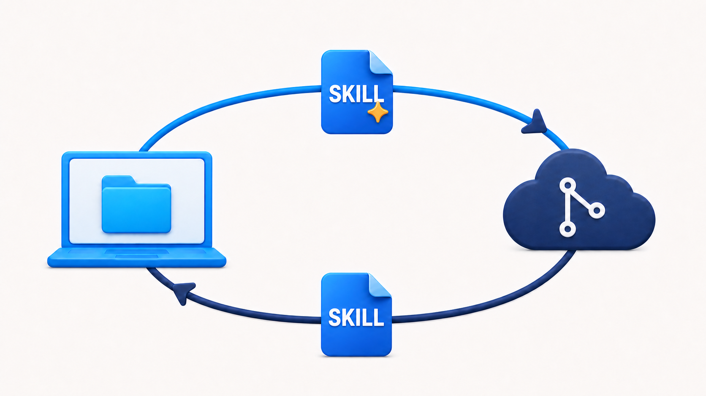

# gh-skill-linker

[](https://github.com/game-dev-rta-club/gh-skill-linker/actions/workflows/ci.yml)
[](https://github.com/game-dev-rta-club/gh-skill-linker/releases/latest)
[](LICENSE)

**Let every project make your Agent Skills better.**

An Agent Skill often reveals its real gaps only while doing real work. But a
fix made inside one project tends to stay there, while editing only the source
misses lessons that emerge during use.

`gh-skill-linker` turns that dead-end copy into a visible feedback loop. It
keeps a reviewable skill inside the local project, remembers its exact GitHub
source and last synchronized revision, and lets improvements return so the next
project can benefit from what the previous one learned.

Install the extension once, then use skills as ordinary project files. Choose a
tag for a fixed snapshot or a branch to exchange improvements. Before anything
moves, `status` shows which side changed; divergent work is surfaced rather
than silently overwritten.



`gh-skill-linker` is a standalone GitHub CLI extension for macOS and Linux. Its
companion Agent Skill lives in this repository and teaches agents the same CLI
workflow. Skill Linker and every source-skill repository are independent
projects: linking a skill does not imply ownership, affiliation, or a runtime
dependency between them.

## Quick start

Requirements: an authenticated [GitHub CLI](https://cli.github.com/), system
Git, and a Git project.

```sh
gh extension install game-dev-rta-club/gh-skill-linker
gh skill-linker install game-dev-rta-club/gh-skill-linker gh-skill-linker --branch main
gh skill-linker status
```

This self-contained example installs this repository's own companion skill:

```text
your-project/
├── .agents/skills/gh-skill-linker/   # reviewable instructions the agent reads
└── .gh-skill-linker.json             # GitHub source and synchronized revision
```

Review and commit both together so collaborators receive the same instructions
and provenance:

```sh
git status --short
git add .agents/skills .gh-skill-linker.json
git diff --cached
git commit -m "chore: install project agent skill"
```

The extension does not commit the parent project for you.

## Design principle

Skills grow through use. Their source is where improvements can be shared, but
the local project is where missing context, awkward instructions, and useful
refinements become visible.

Skill Linker keeps both sides useful instead of making you choose between them.
The project contains the complete skill that people and agents can inspect,
edit, and commit. The GitHub source remains the place that collects those
lessons for the next project:

```text
GitHub source → local use → local improvement → GitHub source → next project
```

That loop needs a trustworthy point of comparison. Skill Linker records the
last synchronized revision alongside the local copy, then compares that
baseline with the current project and source. It can show whether to pull,
push, or resolve a conflict without guessing which change should win.

## How it works

1. `install` copies a discovered skill into `.agents/skills/`.
2. `.gh-skill-linker.json` records where that copy came from.
3. `status` compares the project copy with its source and shows the next
   eligible operation.
4. Branch-backed skills can exchange changes with `pull`, `push`, or
   `push --pr`. Tag-backed skills remain fixed snapshots.

Skill Linker manages one project at a time. It is not a package registry,
global skill manager, or hidden background service.

## Choose a tag or branch

| Source | Choose it when | Behavior |
| --- | --- | --- |
| `--tag TAG` | Consuming a reviewed release | Fixed snapshot; pull and push are disabled |
| `--branch BRANCH` | Authoring or collaborating | Tracks the branch; supports pull, push, and pull requests |

Start with a tag when you only need to use a skill. Choose a branch when you
intend to return improvements to its source.

```sh
# Discover available skills without installing them.
gh skill-linker install OWNER/REPO --tag TAG

# Install one reviewed skill.
gh skill-linker install OWNER/REPO SKILL --tag TAG

# Install one skill for two-way collaboration.
gh skill-linker install OWNER/REPO SKILL --branch BRANCH
```

## Common workflows

| Goal | Command |
| --- | --- |
| Discover skills | `gh skill-linker install OWNER/REPO --branch BRANCH` |
| Install every discovered skill | `gh skill-linker install OWNER/REPO --all --tag TAG` |
| Check local and source state | `gh skill-linker status` |
| Bring in source changes | `gh skill-linker pull SKILL` |
| Return a local change | `gh skill-linker push SKILL` |
| Propose a local change | `gh skill-linker push SKILL --pr` |
| Publish a new local skill | `gh skill-linker publish OWNER/REPO SKILL --branch BRANCH` |
| Stop managing a skill | `gh skill-linker uninstall SKILL` |

Run `gh skill-linker <command> --help` for complete arguments and examples.
See the [user guide](docs/user-guide.md) for tag upgrades, branch collaboration,
conflict resolution, publishing, and removal.

## Safety and limits

- Review every Agent Skill before installing it. Skills are instructions to an
  agent and should be treated as trusted code.
- A push stops when the source changed after the last synchronization.
- Text conflicts remain visible as Git-style markers for manual resolution.
- Tag-backed skills cannot pull or push.
- The extension never force-pushes and never commits the parent project.

Releases are immutable and include SHA-256 checksums and signed GitHub build
provenance. See [Verifying release artifacts](docs/release-verification.md) and
the [safety model](docs/spec/3_Functions/pages/architecture/safety-model.md).
Report vulnerabilities privately through [SECURITY.md](SECURITY.md).

## Documentation

The [documentation index](docs/README.md) links to the user guide, command
documentation, design specifications, release verification, and migration
notes.

## Community

Bugs and ideas are welcome in
[GitHub Issues](https://github.com/game-dev-rta-club/gh-skill-linker/issues).
See [CONTRIBUTING.md](CONTRIBUTING.md) before contributing. General contact is
available through the
[Game Dev RTA Club Google Group](https://groups.google.com/g/game-dev-rta-club).

This is a pre-1.0, volunteer-maintained project. Response times, releases,
fixes, and long-term maintenance are not guaranteed.

## License

[MIT](LICENSE) © 2026 Game Dev RTA Club.
